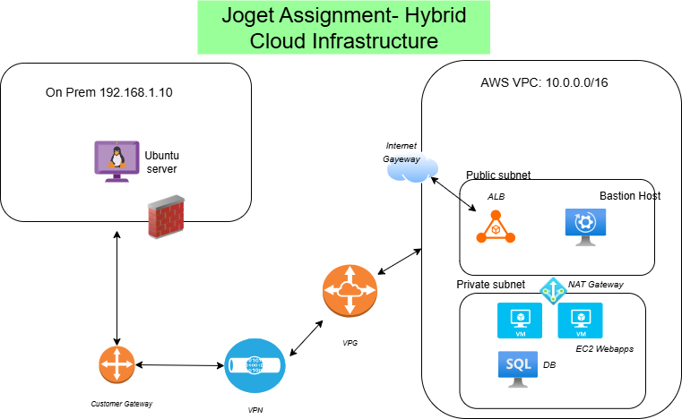

# Hybrid Cloud Infrastructure – Cloud Engineer Assignment

This project is a hybrid cloud proof-of-concept that simulates an on-premise environment and partially migrates a legacy Java web application (hosted with Apache and MySQL) to AWS. The solution leverages Terraform for IaC, AWS for scalable deployment, and Bash for on-prem configuration automation.

## [Project Overview]()

- **On-Prem Simulation**: Ubuntu server hosting Apache + MySQL, configured via Bash script.
- **AWS Cloud Architecture**:
  - VPC with public/private subnets across 2 AZs
  - EC2 instances for Apache (web) and Joget (Java app)
  - Application Load Balancer (ALB) for traffic distribution
  - RDS MySQL database in private subnet
- **Security**: Segmented network with Security Groups and IAM roles
- **Automation**: Terraform IaC, optional Ansible for app setup
- **Monitoring & DR**: CloudWatch monitoring and RDS snapshot-based DR

---

## [Architecture Diagram]()



---

## [- On-Prem Simulation -]()

* **OS** : Ubuntu 22.04 (simulated via local VM)
* **Services** : Apache2, MySQL, Java App
* **Network** : Static IP (`192.168.1.10`), UFW firewall enabled
* **VPN Concept** : AWS Site-to-Site VPN (simulated)

### `scripts/setup_onprem.sh`

The `on_prem_setup.sh` script automates the setup of the simulated on-premise environment.

- Updates system packages
- Installs Apache and MySQL
- Configures UFW firewall rules
- Starts and enables services

## [- AWS Cloud Infrastructure – Key Components -]()

* **VPC** : With 2 Public and 2 Private Subnets (across 2 AZs)
* **Web Layer** :
  * 2 x EC2 (t3.micro) with Apache and Java App
  * ALB distributes traffic
* **Database Layer** :
  * RDS for MySQL (db.t3.micro), private subnet
* **NAT Gateway** : Enables outbound internet from private subnets
* **IAM** : Least-privilege roles for EC2, RDS
* **Security Groups** :
  * ALB → EC2: HTTP/HTTPS
  * EC2 → RDS: MySQL only
  * No public access to RDS or private EC2

## [- Deployment -]()

- AWS CLI configured (`aws configure`)
- Terraform files
- SSH key pair exists in AWS

After the tf file are vaidated

```bash
terraform init
terraform plan
terraform apply
```

Destroy

```bash
terraform destroy
```

---

Terraform State Management :

This PoC uses local backend for Terraform state. In production, this should be moved to a remote backend (e.g., S3 + DynamoDB) with locking and versioning to prevent drift and manage changes securely.

---

## [- VPN Connectivity -]()


**Simulated VPN** : Site-to-Site VPN (Conceptual)

* **Steps** :
  * AWS Virtual Private Gateway attachment
  * Customer Gateway setup (with on-prem IP)
  * VPN Connection + Routing Tables update
  * On-prem firewall allows VPN tunnel traffic (UDP ports 500, 4500)

## [- VPN Configuration (Conceptual) -]()

To establish secure connectivity between the simulated on-premise environment and the AWS VPC, a **Site-to-Site VPN** setup is conceptually proposed. This allows private IP communication over an encrypted IPSec tunnel.

**Example (`ipsec.conf` for strongSwan):**

```conf
conn aws-vpn
    left=192.168.1.10
    leftid=203.0.113.5
    leftsubnet=192.168.1.0/24
    right=18.204.10.2
    rightsubnet=10.0.0.0/16
    auto=start
    ike=aes256-sha1-modp1024
    esp=aes256-sha1
    keyexchange=ikev1
```

##### AWS Side

* **Create a Virtual Private Gateway (VGW)**
  * Attach it to the VPC so it can accept VPN traffic.
* **Set up a Customer Gateway**
  * Use the on-premise public IP
* **Create a Site-to-Site VPN Connection**
  * Link the VGW and CGW, choose static or dynamic routing, and download the config.
* **Update VPC Route Tables**
  * Add a route to the on-premise network (e.g., `192.168.1.0/24`) via the VGW.
* **Security Groups & NACLs**
  * Open only the required ports (e.g., MySQL 3306, HTTP 80) for on-prem IP ranges.

## [Security Configuration]()

* ALB allows **HTTP (port 80)** from the internet
* EC2 application servers only accept traffic from the ALB
* RDS only accepts **MySQL (port 3306)** from EC2 app security group
* No public access to private subnets or the RDS instance
* (Optional) Bastion host can be used for admin SSH access, restricted to your IP

## [Hybrid Connectivity Plan]()

- We're simulating a **Site-to-Site VPN** tunnel using **strongSwan** on the on-prem side and an AWS **Virtual Private Gateway** on the cloud side.
- **Routing**: Static routes
- All traffic between the on-prem server and AWS VPC is encrypted using  **IPSec** .

## [Backup and Disaster Recovery]()

**Amazon RDS:**

* Automated daily backups enabled
* Manual snapshots created and retained
* Can be restored to another region if needed

**On-Premise Server:**

* MySQL dumps stored locally in /backups
* Uploaded to S3 daily using:

  ```bash
  aws s3 cp /backups s3://joget-onprem-backups --recursive
  ```

## [Monitoring and Alerts]()

- **Metrics to watch**:
  - EC2 CPU Utilization > 80%
  - RDS Free Storage < 10%
  - ALB returning 5xx errors
- **Alarms & Alerts**:
  - CloudWatch Alarms

## [Change and Configuration Management]()

- Infrastructure is defined and version controlled using **Terraform**
- To detect drift: run `terraform plan` regularly
- Future plan: store secrets like DB credentials in **AWS Secrets Manager**
- All config and code tracked in GitHub

## [Assumptions]()

- Cost was prioritized over full redundancy
- VPN is simulated, not physically deployed

## [Challenges and Trade-offs]()

- **NAT Gateway** adds cost, but needed for internet access from private subnets

## [Future Improvements]()

- Set up CI/CD with GitHub Actions
- Use AWS Secrets Manager for DB credentials
- Replace simulated VPN with real IPSec VPN if hardware available
